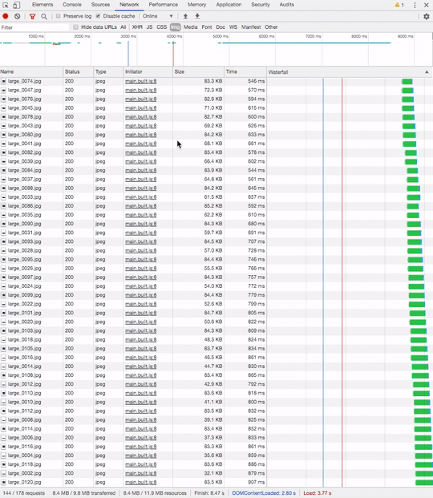

# canvas-sprite-animation

This is my implementation of animation from a bunch of png/jpg files based on canvas.


Apple have used this technique on the MacBook Pro 16 promo page:
https://www.apple.com/macbook-pro-16/


The advantage of this technique is that we will have more control over the frames loading. We can fetch frames much faster and efficient way by skiping intermediate frames.




Usage:

```html
<canvas id="canvas-element" width="400" height="300"></canvas>
```

```javascript
const canvasEl = document.getElementById('canvas-element');

const CanvasAnimation = new CanvasSpriteController({
  isParralelFetch: true,
  mainCanvas: canvasEl,
  width: 400, 
  height: 300,
  totalFrames: 240, 
  getUrlSchema: (frameId) => `sprite/${this.getNameNum(frameId)}.png`,
});
```


Best results you can get by using it with some tweening library like `gsap` 
