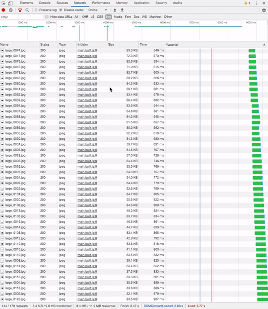

# canvas-sprite-animation

This is my implementation of animation from a bunch of png/jpg files based on canvas.

Apple have used this technique on the MacBook Pro 16 promo page:
https://www.apple.com/macbook-pro-16/

The advantage of this solution is that we will have more control over the loading of frames. We can fetch frames much faster and efficient way by skiping intermediate frames.

Tap on the star if it was helpful for you!
